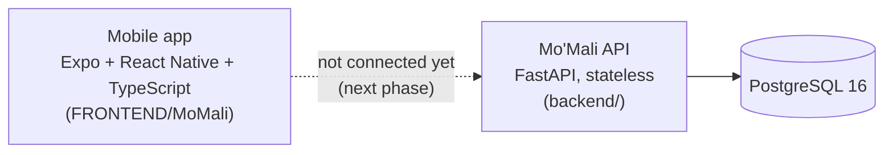
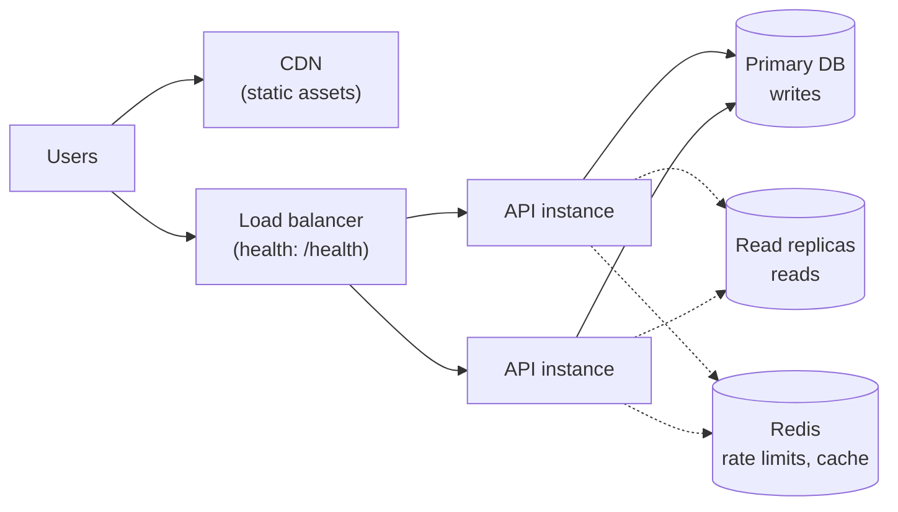

# Mo'Mali architecture

Status: October 2026, after Phase 1 (app fixes) and Phase 2 (backend skeleton).

## What exists today

- **Mobile app.** Runs on demo data stored on the device. It has a device-local sign-in, consent scopes enforced in its service layer, budgets, and a health score.
- **API.** Has real accounts, tokens, budgets, consent management, insights and POPIA endpoints, but the app does not call it yet. Connecting the two is the next step: the "Week 3" plan in the production-readiness audit.
- **Bank data.** Every new account gets the same demo transactions the app uses. No bank or Open Finance provider is connected. A teammate's UCT FinHub sandbox integration on the `authentication-flow` branch is the intended source to port in.

## Design decisions

| Decision | Why |
|---|---|
| **Stateless API.** No in-memory sessions or caches; configuration only from environment variables. | Any number of identical instances can run behind a load balancer, and rolling deploys are possible later without code changes. |
| **Short-lived JWT access tokens (15 min) plus rotating refresh tokens** stored only as SHA-256 hashes in `sessions`. | A database leak does not expose usable refresh tokens. Each refresh token works once. Replaying a rotated-out token ends that whole login (theft detection). |
| **Argon2id** password hashing. | Current recommended password hash; parameters upgrade automatically on login. |
| **Consent enforced twice:** in the app's service layer and in the API (`require_scope`). | The API is the real boundary. A modified or buggy client cannot read transactions without `transactions:read`. |
| **Audit log with an allow-list** of detail keys (`scope`, `fields`). | POPIA-relevant actions are recorded. Personal data cannot be written into the log by accident. |
| **One error format, no raw errors.** `{"error": {"code", "message", "reference"}}`. Unexpected errors are caught before the server's traceback logging. | Users see plain language. The `reference` matches the `X-Request-ID` header and a log line, so support can investigate without logs holding personal data. |
| **Migrations as a separate one-off job** (`migrate` service in `docker-compose.yml`). | Several API instances can start together without racing on schema changes. |
| **Tests run the real Alembic migrations on PostgreSQL** and fail if models and migrations drift (`alembic check`). | This is the failure mode that broke an earlier backend attempt (tables missing in migrations). |

## Data model

| Table | Purpose |
|---|---|
| `users` | Email (lower-case, unique) and Argon2id password hash. `deleted_at` is reserved for a future grace-period deletion; `DELETE /me` erases immediately. |
| `sessions` | Refresh tokens (hash only), grouped in a `family_id` per login, with expiry, revocation and rotation link. |
| `budgets` | Monthly limit per category; one per user, category and period. |
| `transactions` | Positive `amount` plus `type` (`income` / `expense`), category, merchant, date. |
| `consents` | One row per grant of one scope, with `granted_at` / `revoked_at`. At most one active grant per user and scope. |
| `audit_logs` | Action, resource, non-personal details, timestamp. `user_id` becomes NULL when an account is erased. |

User-owned rows use `ON DELETE CASCADE`, so deleting a user erases their data in one statement.

## Deferred infrastructure (target architecture)

The production-readiness plan describes a CDN, a load balancer, read replicas and Redis. **These are deliberately not built yet.** The business plan targets 300 pilot students in month 1 and about 5,000 active users by month 12.

Our judgement (an opinion, not a measured result) is that at this scale, one managed PostgreSQL database and one or two API instances are enough. Replicas and caches would add cost and new ways to fail (replica lag, cache invalidation) before there is load to justify them. The API is already shaped so each piece can be added without rewriting endpoints.

| Component | What it would solve | Add it when (suggested triggers) | Already prepared |
|---|---|---|---|
| Load balancer + 2–3 API instances | Zero-downtime deploys, instance failure | Before the first public launch, or when one instance's CPU stays high | Stateless API, `/health` checks the database, migrations run as a separate job |
| Redis rate limiting | Brute-force protection on login/register shared across instances | **As soon as the API is internet-facing** (this is the most urgent gap) | Nothing yet; a single-instance limiter would be lost on restart and wrong behind a balancer |
| Read replicas + read/write routing | Primary overloaded by reads | When primary database CPU or read latency is the bottleneck in monitoring | All database access goes through `get_db` (`app/core/database.py`), the one place to add routing |
| Redis cache | Repeated expensive reads | When profiling shows a hot read path | Responses are already computed per request; no cache coherence to unwind |
| CDN | Asset download speed far from the origin | When serving app assets or images from our own origin | Expo builds already ship bundles with hashed file names suitable for long caching |

## Known gaps

- No rate limiting on authentication endpoints yet (see above). Until it exists, keep the API behind a gateway or platform rate limit.
- No email verification or password reset.
- After logout, an access token keeps working until it expires (at most 15 minutes). Deleted accounts are rejected immediately.
- The mobile app's local sign-in accepts a 4–8 digit PIN; API accounts require a password of at least 8 characters. Align these when the app is connected.
- `safe-to-spend` is implemented as a tested formula, but returns "not available" until balances and next-income dates exist.
